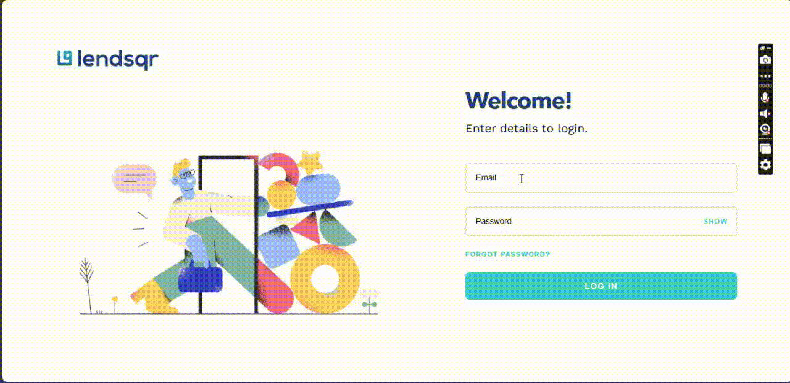
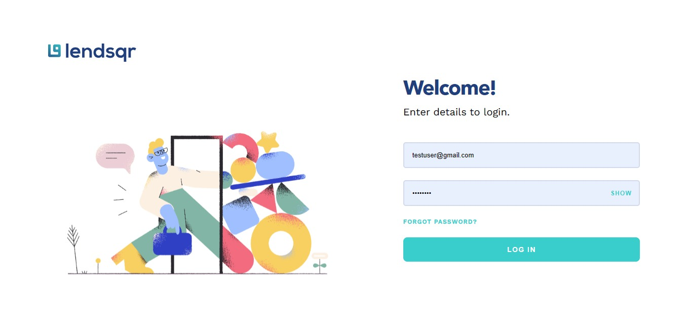
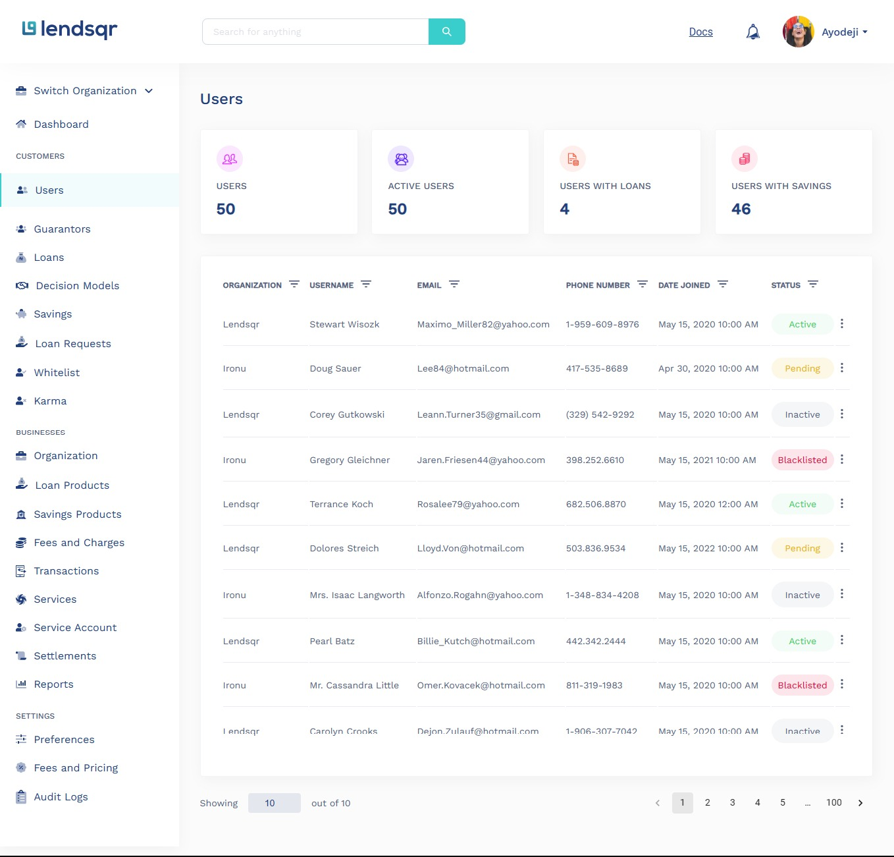
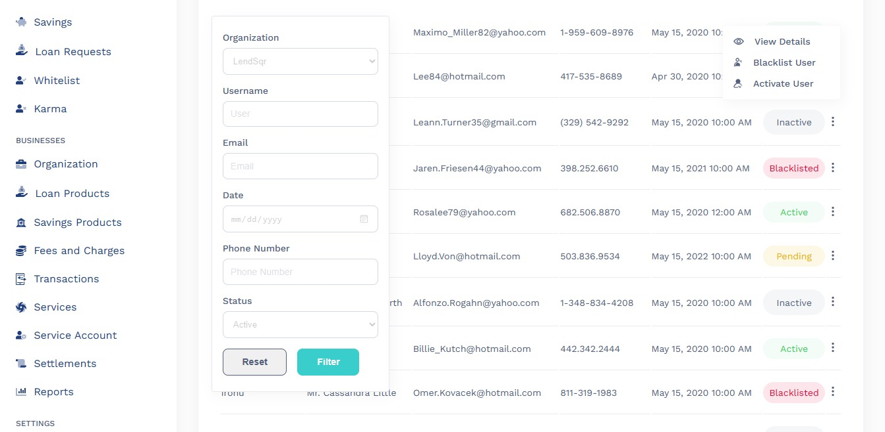
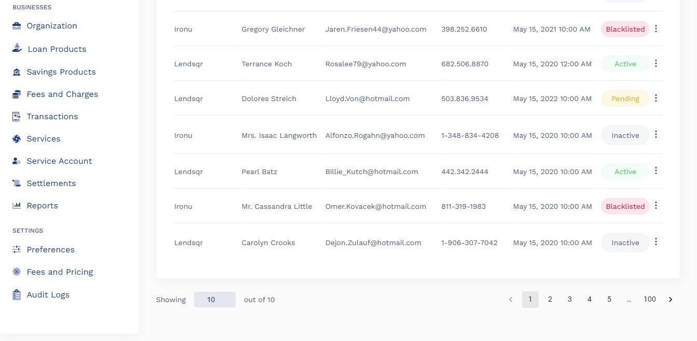
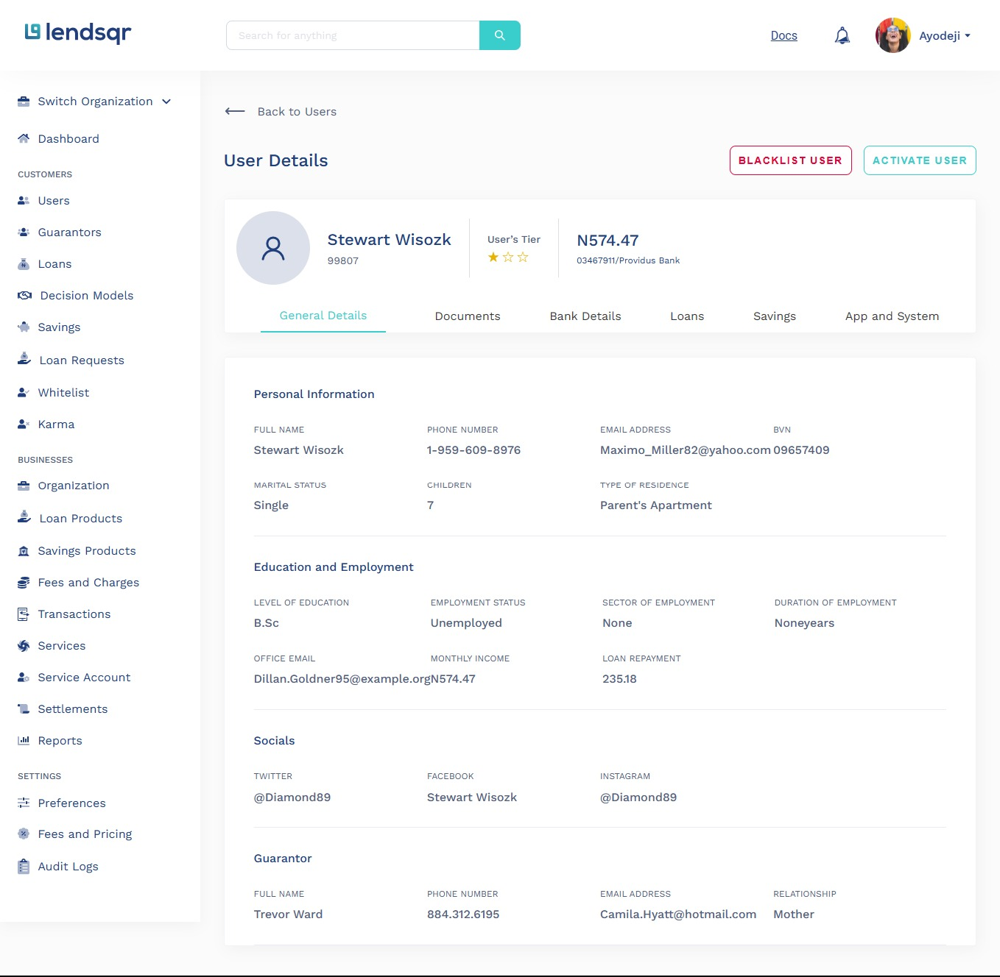

# LendSqr Admin Console

A web app to oversee the user details of lenders on the main application


## Login Demo
To login use this details:
Email: testuser@gmail.com
Password: test1234


## View Details Demo


## Screenshots







## Live Link

[View](https://temiloluwa-oyedare-lendsqr-fe-test.vercel.app/)
## Run Locally

Clone the project

```bash
  git clone https://github.com/Oyedare/lendsqr-fe-test.git
```

Go to the project directory

```bash
  cd lendsqr-fe-test
```

Install dependencies

```bash
  npm install
```

Start the server

```bash
  npm run dev
```

Start the build

```bash
  npm run build
```


## Tech Stack

**Client:** NextJS, TypeScript,Sass

**Api/Database:** Mock Api


## Contributor

- [@Oyedare](https://www.github.com/Oyedare)

